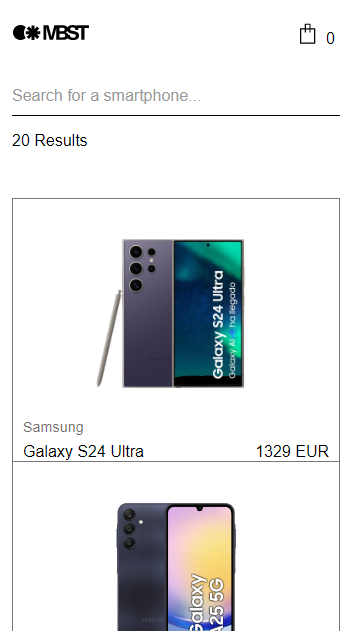
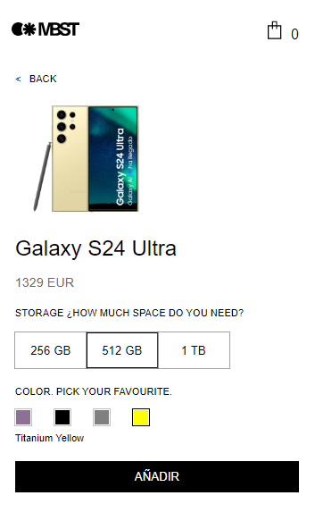
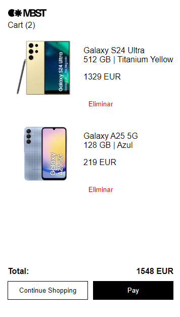

# Zara Challenge

## 📌 Descripción
Este proyecto consiste en una tienda de dispositivos móviles desarrollada con **React + Vite**. Permite listar, buscar, filtrar y ver detalles de teléfonos, así como agregar productos a un carrito de compras persistente, su diseño es para mobile.

---

## 📌 Cómo Ejecutar el Proyecto
1. Clonar el repositorio:
   ```bash
   git clone https://github.com/tu-repo/zara-challenge.git
   ```
2. Instalar dependencias:
   ```bash
   cd zara-challenge
   npm install
   ```
3. Ejecutar el servidor de desarrollo:
   ```bash
   npm run dev
   ```

## 📁 Estructura del Proyecto
```
/src
  /components   # Componentes reutilizables
  /context      # Context API para la gestión del estado global
  /hooks        # Custom hooks
  /pages        # Páginas principales del proyecto
    /Home       # Página principal con el listado de teléfonos
    /PhoneDetail # Página de detalles del teléfono
    /Cart       # Página del carrito de compras
  /services     # Servicios para consumo de API
  /utils        # Funciones de utilidad
```

### 📦 Dependencias
- **Axios** → Manejo de peticiones HTTP

### 👀 .env
Consulta ***.env.example*** para ver cómo se deben declarar las variables de entorno.

---

## 🖥️ 1. Vista Listado de Teléfonos




---

## 📱 2. Vista Detalle de Teléfono




---

## 🛒 3. Vista de Carrito




---

## 🚀 Stack Tecnológico
- **Frontend:** React 18 y CSS
- **Gestión de Estado:** React Context API
- **Autenticación:** Manejo del parámetro `x-api-key` en las peticiones

---


## 📋 Próximas Mejoras
- [ ] Implementar pruebas unitarias con Vitest y React Testing Library.
- [ ] Implementar diseño responsive para escritorio.

---

📌 **Autor:** Nicolás Ogno
📅 **Fecha:** Marzo 2025

